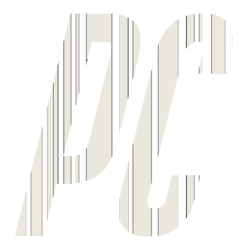

# PassCraft: Your Event Pass Generator

PassCraft is a powerful and user-friendly web application that allows you to generate custom membership cards and e-tickets for various events and purposes. Whether you need personalized cards for exclusive club members or digital tickets for an upcoming event, PassCraft has got you covered. The app provides a seamless and efficient way to create professional passes with individual names and unique QR codes, simplifying your event management process.

## Features

- **Customizable Passes**: Individualize your customized template by automatically adding recipient names onto it.

- **QR Code Integration**: Easily add QR codes to each pass for quick and secure verification, making it ideal for events and access control.

- **Dark Mode**: PassCraft offers a user-friendly dark mode, ensuring a comfortable user experience during low-light conditions.

## How to Use

1. **Welcome Page**: Start by visiting the welcome page. Here, you'll find a brief introduction to PassCraft along with essential instructions.

2. **Getting Started**: Before creating passes, ensure you have your desired template and recipient information ready. If you're planning to send passes via email, ensure you have a valid app password.

3. **Create Passes**: Click the "Begin Form" button on the welcome page to create custom passes. Fill in the required details, choose a template, and add QR codes if needed.

4. **Dark Mode**: PassCraft supports dark mode for an improved user experience. Toggle the dark mode switch in the header to enable or disable dark mode.

5. **Export and Distribute**: Once you've designed your passes, export them for easy printing and distribution or distribute them over email.

6. **Efficient Event Management**: With PassCraft, managing your event attendees becomes a breeze. Scan the QR codes on the passes for quick and smooth entry verification.

## Installation and Deployment

1. Clone this repository to your local machine.

2. Ensure you have Python installed. Use virtual environments for dependency management.

3. Install the required packages from `requirements.txt` using `pip install -r requirements.txt`.

4. Run the app using `python app.py`.

5. Visit `http://localhost:5000` in your web browser to access PassCraft.

## Technologies Used

- Python
- Flask
- HTML/CSS
- JavaScript

## Contributing

Contributions are welcome! If you find any issues or have feature suggestions, please open an issue or submit a pull request.

---

<kbd style="background-color: #E98074; color: #EAE7DC; padding: 8px 16px; border-radius: 4px; font-size: 14px;">Color Scheme: #EAE7DC, #E98074, #8E8D8A, #3b82f6, #E85A4F</kbd>

---
